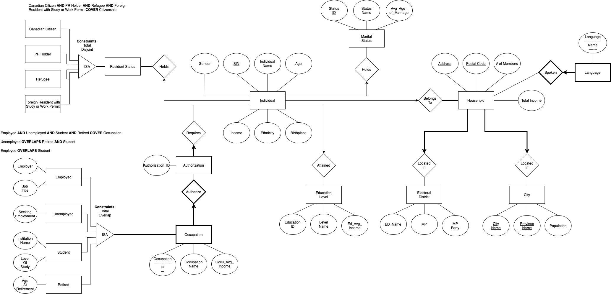

<h1> National Census Database Project </h1>

Team number: 69  
Team members: Allison Jiao, Manjot Singh, William Sun

<h2> Project Description</h2>
The project proposes a <b>National Census Management system</b>, to efficiently store, analyze and manage the census data. 
The domain of the application(survey/census taking/population management). 
<i>The main goal is to facilitate the collection, management, and analysis of national population and housing census data.</i>
 
<h2> Timeline and task breakdown</h2>
Our group will code from end-to-end means. Every team member will do both front end and back end for a part of the project.
<h3> Task Timeline </h3>

<h3> Task Breakdown </h3>

Link to the specific timeline and breakdown: 
<a href="Timeline and Breakdown/Milestone 3-tasks.html">gannt project</a>

